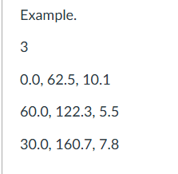

# Car Acceleration Computation using C and x86-64 Assembly (Scalar SIMD)

This project implements a car acceleration calculator that computes acceleration values based on initial velocity, final velocity, and time using both C and x86-64 Assembly. The goal is to measure performance while applying **scalar SIMD floating-point instructions** in Assembly.

---

## Problem Description

A car's performance is measured through acceleration over a 1 KM distance. Each test provides:

- Initial velocity (**Vi**) in KM/H
- Final velocity (**Vf**) in KM/H
- Time (**T**) in seconds

The formula used:

Acceleration = (Vf - Vi) / T
With velocities converted from KM/H to m/s:

The output acceleration values are rounded and returned as integers.

## Input Format

- Number of rows `Y` (number of cars)
- A Y x 3 matrix of single-precision float values
  - Column 1: Initial Velocity (Vi) in KM/H
  - Column 2: Final Velocity (Vf) in KM/H
  - Column 3: Time (T) in seconds

Example:


This is an xample of the input format where the first line indicates the number of cars, followed by three columns for each car's initial velocity, final velocity, and time.
This example is provided in the specification document.


##  Output

Integer acceleration values (m/s²) for each car, one per line:

Example:
2
3
5

# Execution Time and Short Analysis of Performance

## Execution Time
Tnanosecondshe asembly function `computeAcceleration` is called from a C program that loops through the input data. The assembly function performs the acceleration calculation using scalar SIMD floating-point instructions.
We can see the execution time in the following image below with 4 test row sizes mainl<br>y: 10,100,1000,10000.
<br>
The average execution time for the program is signifiantly lower than C being the callee , demonstrating the performance benefits of using assembly language for this computation.
Since the looping is done in C language and the assembly function is being called for every iteration, the average execution time is more faster than expected.
## Short Analysis of Performance
Performing a benchmark of the program, we saw that the time complexity of the function written in assembly executes in the **nanoseconds** range given a small input size, which is typical of algorithms written in assembly.
>Additionally, benchmarking input size in the hundreds to thousands seen from the *Execution Time section*, we see that the time complexity of the algorithm roughly follows an O(n) growth.


 ## Screenshots of the Output with Correctness Check


The given inputs above is formatted as `Vi,Vf, T` for each car in the matrix.


**Inputs:**
```
3
0.0 62.5 10.1
60.0 122.3 5.5
30.0 160.7 7.8
```


**Outputs:**
```
2
3
5
```


**Manual Calculation (to verify): **
```
(((62.5-0.0) x 1000) x 1/3600)/10.1 = 2 (converted to int)
(((122.3 - 60.0) x 1000) x 1/3600)/5.5 = 3 (converted to int)
(((160.7 - 30.0) x 1000) x 1/3600)/7.8 = 5 (converted to int)
```


]


**Inputs:**
```
4	
10.0 55.0 9.0 
20.0 80.0 8.0
10.0 90.0 15.0
0.0 100.0 12.0
```


**Outputs:**
```
1
2
1
2
```


**Manual Computations (to verify): **
```
(((55.0-10.0) x 1000) x 1/3600)/9.0 = 1 (converted to int)
(((80.0-20.0) x 1000) x 1/3600)/8.0 = 2 (converted to int)
(((90.0-10.0) x 1000) x 1/3600)/15.0 = 1 (converted to int)
(((100.0-0.0) x 1000) x 1/3600)/12.0 = 2 (converted to int)
```


